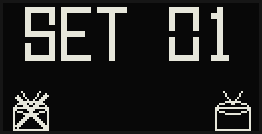

# Quick Start

## Prerequisites (one-time setup)

```bash
sudo bash ~/rig/patch_midi.sh        # VirMIDI kernel module + Processing MIDI patch
sudo bash ~/rig/setup_sudoers.sh     # passwordless systemctl for argon OLED daemon
```

**Python deps — pick one:**

```bash
# Option A: system-wide (if your autostart uses `sudo python3`)
sudo pip install sounddevice soundfile numpy mido python-rtmidi evdev \
                 adafruit-circuitpython-ssd1306 pillow --break-system-packages

# Option B: venv (if your autostart uses `sudo /home/nmlstyl/rig/venv/bin/python`)
bash ~/rig/install_multichannel.sh
```

See README.md §9 for full details on both options.

- Zoom L6 connected via USB, set to **Multi Track** mode (Menu → USB → Mode → Multi Track)
- I2C enabled: `sudo raspi-config` → Interface Options → I2C → Enable

## Step 1: Add your tracks

Each song needs three files in a `set-XX/song-XX/` folder:
```
~/rig/set-01/song-01/title.wav
~/rig/set-01/song-01/metronome.wav
~/rig/set-01/song-01/midi-for-processing.midi
```

Optionally add `info.txt` for display metadata:
```
title: My Song
bpm: 120
platform: Ableton
```

## Step 2: Audio device (usually skip this)

`AUDIO_DEVICE = None` auto-detects the Zoom L6 by name. If auto-detect fails, pin it manually:

```bash
python3 -c "import sounddevice as sd; print(sd.query_devices())"
```

Find the Zoom L6 entry (e.g. `[2] L6: USB Audio`) and set in `controller.py`:
```python
AUDIO_DEVICE = 2   # pin to specific index; None = always auto-detect
```

## Step 3: Run

The controller launches automatically via `~/.config/labwc/autostart` on boot. To run manually:

```bash
sudo ~/rig/venv/bin/python ~/rig/controller.py
```

Expected startup output:
```
Starting Performance Rig...
Stopped argononed           ← (or argone-oled / argonone-led)
Taskbar hidden
Found 4 tracks
  1. Set 1 - Song 1
  2. Set 1 - Song 2
  ...
Virtual MIDI port: RigMIDI
Processing launched (PID 12345)
MIDI bridged 128:0 → 14:0
Auto-detected Zoom L6: L6: USB Audio (device 2)
Ready!  ← prev  → next  ↓ play  ↑ pause  ESC/↑←→ quit
```

## Controls

| Key | Action |
|-----|--------|
| `←` | Previous track |
| `→` | Next track |
| `↓` | Play |
| `↑` | Pause / Resume |
| `ESC` | Exit |
| `↑` + `←` + `→` | Exit combo |

## Set Picker (boot screen)



Use `↑`/`↓` to navigate sets, then:
- `←` — confirm in **drumless** mode
- `→` — confirm in **full mix** mode (with drums)

## OLED

- **Top ticker**: track number + title, BPM, platform (scrolls if too wide)
- **Middle**: remaining time (`3:42 left`) or `PAUSED` while playing
- **Bottom**: elapsed time since the set started (large clock)

## Autostart

The rig is launched from `~/.config/labwc/autostart`, not as a systemd service. Do not enable `performance-rig.service`.

```bash
# ~/.config/labwc/autostart
bash -c 'until systemctl --user is-active pipewire > /dev/null 2>&1; do sleep 0.5; done; sudo /home/nmlstyl/rig/venv/bin/python /home/nmlstyl/rig/controller.py' &
```

See README.md for full setup documentation.
