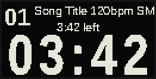
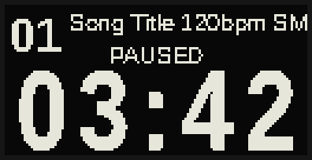
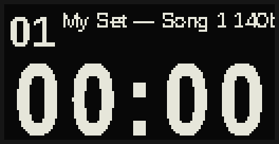

# Live Performance Rig

Python controller for Raspberry Pi (Argon One V5) that synchronizes:
- 2 audio tracks routed to separate Zoom L6 outputs
- MIDI file playback driving a Processing visual sketch
- SSD1306 OLED display (built into Argon case)
- USB keyboard control (4 arrow keys + ESC)

## System Architecture

```
USB Keyboard (←→↑↓ ESC)
       │
  controller.py
  ├── TrackManager  — scans ~/rig/set-*/song-*/
  ├── Player        — sounddevice 4-ch audio + mido MIDI
  ├── Display       — SSD1306 OLED via I2C
  └── Keyboard      — evdev arrow keys
       │                        │
  Processing sketch        Zoom L6
  (HDMI visuals)       Out 1-2: title.wav
                       Out 3-4: metronome.wav
```

## File Structure

```
~/rig/
├── set-01/
│   ├── song-01/
│   │   ├── title.wav              # main audio → L6 outputs 1-2
│   │   ├── metronome.wav          # click track → L6 outputs 3-4
│   │   ├── midi-for-processing.midi
│   │   └── info.txt               # optional metadata (see below)
│   └── song-02/...
└── set-02/...
```

**`info.txt` format** (all fields optional):
```
title: My Song Name
bpm: 120
platform: SMD
timing: 11/4
```

- `title` — display name shown on OLED ticker (defaults to folder name)
- `bpm` — injected as a MIDI tempo event if the MIDI file has none
- `platform` / `timing` — shown on OLED ticker alongside title and BPM
- Legacy: a `bpm.txt` file containing just the BPM number is also accepted as a fallback

## Set Selection Screen

Shown at every boot for set and mode selection:


| Key | Action |
|-----|--------|
| `↑` / `↓` | Navigate sets (slides in from top/bottom, wraps) |
| `←` | Confirm — **drumless** mode (drum icon with ✕, left) |
| `→` | Confirm — **full mix** mode (drum icon, right) |

Once confirmed, the rig loads all tracks from the selected set.

---

## Controls

| Key | Action |
|-----|--------|
| `←` | Stop and go to previous track |
| `→` | Stop and go to next track |
| `↓` | Play (starts audio + MIDI simultaneously) |
| `↑` | Pause / Resume |
| `ESC` | Exit (graceful shutdown) |
| `↑` + `←` + `→` | Exit combo (hold all three simultaneously) |

If the combo is not completed, each key fires its normal action on release.

## OLED Layout

**Playing:**


**Paused:**


**Ready (before first play):**


- **Ticker** (top): large track number on the left; scrolling `title bpm platform` on the right
- **Countdown** (middle): remaining time (`M:SS left`) or `PAUSED`
- **Set clock** (bottom half): elapsed time since the first track started, scaled to fill

---

## Raspberry Pi Setup

### 1. Enable I2C (for OLED)

```bash
sudo raspi-config
# Interface Options → I2C → Enable
```

Or add to `/boot/firmware/config.txt`:
```
dtparam=i2c_arm=on
```

Verify the OLED is detected at `0x3C`:
```bash
i2cdetect -y 1
```

### 2. PipeWire Audio

The rig uses `sounddevice` which routes through PipeWire. Verify it's running:
```bash
systemctl --user status pipewire pipewire-pulse wireplumber
```

If not running:
```bash
systemctl --user enable --now pipewire pipewire-pulse wireplumber
```

PipeWire must be alive for the user session before `controller.py` starts — the labwc autostart (section 8) handles this.

### 3. Zoom L6 Multi-Channel Routing

The Zoom L6 presents as a multi-channel USB audio device. Connect via USB; no extra drivers needed on Pi OS.

**`AUDIO_DEVICE = None`** auto-detects by searching device names for `zoom`, `l6`, or `l-6` with ≥4 output channels. No configuration needed in the normal case.

To pin a specific device:
```bash
python3 -c "import sounddevice as sd; print(sd.query_devices())"
```

Look for `L6: USB Audio` or `Zoom L-6`, then set the index in `controller.py`:
```python
AUDIO_DEVICE = 2      # pin to a specific device index
```

If the index is stale after a reconnect (`PaErrorCode -9998`), use `None` instead.

**Zoom L6 must be in 4-ch (multi-track) mode**, not stereo. On the device:
- Menu → USB → Mode → Multi Track

**ALSA config for consistent device naming** — add to `/etc/udev/rules.d/99-zoom.rules`:
```
SUBSYSTEM=="sound", ATTRS{idVendor}=="1686", ATTRS{idProduct}=="0045", ATTR{id}="ZoomL6"
```
Then `sudo udevadm control --reload && sudo udevadm trigger`. Now the device always appears as `hw:ZoomL6` for ALSA-level tools (this does not affect sounddevice auto-detection).

### 4. VirMIDI Kernel Module (MIDI bridge to Processing)

The controller creates a virtual ALSA MIDI port (`RigMIDI`) and bridges it to VirMIDI, which Processing can open as a raw MIDI device.

**Load the module:**
```bash
sudo modprobe snd_virmidi midi_devs=1
```

**Make it persistent** — add to `/etc/modules`:
```
snd_virmidi
```

**Verify it loaded:**
```bash
aconnect -l
# Should show: "Virtual Raw MIDI 0-0" or similar
```

If VirMIDI doesn't appear, run:
```bash
sudo bash ~/rig/patch_midi.sh
```

`patch_midi.sh` does three things (one-time only):
1. Loads `snd_virmidi` and makes it persistent in `/etc/modules`
2. Patches `MidiHandler.java` to open the VirMIDI device
3. Recompiles and hot-patches the class into `sticker_spinner.jar`

### 5. Argon One V5 — Stopping the OLED Daemon

Stops all three Argon OLED service names (`argononed`, `argone-oled`, `argonone-led`) on startup and restarts only the ones that were active on exit.

**Grant passwordless systemctl access** (only needed if running as a non-root user — see section 8):
```bash
sudo bash ~/rig/setup_sudoers.sh
```

This writes `/etc/sudoers.d/rig-argon` covering all three service names.

**I2C address:** the Argon One OLED is at `0x3C` on I2C bus 1 (the default).

### 6. Keyboard and I2C Permissions

The controller normally runs as root via the autostart (see section 8), so no group changes are needed for production use.

If you want to run as a non-root user, add yourself to the required groups:

```bash
sudo usermod -a -G input,i2c nmlstyl
# log out and back in for group membership to take effect
```

`evdev` needs the `input` group; I2C needs the `i2c` group. Without root or these groups, keyboard grab and OLED will fail.

### 7. Desktop Taskbar (labwc / wf-panel-pi)

On startup `controller.py` kills `wf-panel-pi`; on exit it relaunches it under `lwrespawn` to restore cleanly.

**Do not kill the panel in autostart.** An earlier hack added these lines to `~/.config/labwc/autostart`:
```bash
# BAD — causes panel to glitch / shell to break after controller exits
sleep 1 && pkill -f "lwrespawn.*wf-panel-pi" && pkill wf-panel-pi &
```
Killing `lwrespawn` externally causes the panel to oscillate between hide/show until the shell stops responding. The controller manages the panel lifecycle — autostart just needs to launch the controller.

### 8. Autostart (recommended) vs Systemd Service

Launch from `~/.config/labwc/autostart` — the controller needs the desktop session (Processing needs a display, taskbar management needs labwc).

The autostart waits for PipeWire then launches via the venv's Python (so all deps are available to root):
```bash
bash -c 'until systemctl --user is-active pipewire > /dev/null 2>&1; do sleep 0.5; done; sudo /home/nmlstyl/rig/venv/bin/python /home/nmlstyl/rig/controller.py' &
```

**Do NOT enable `performance-rig.service`** — it fires before the desktop exists, fails, then retries and collides with the autostart. Keep it disabled:
```bash
sudo systemctl disable performance-rig.service
```

To check it's not running twice:
```bash
pgrep -a python | grep controller
```

### 9. Python Dependencies

Two ways to install. Pick one and use it consistently.

---

#### Option A — System-wide (simpler, current default)

Installs packages into the system Python so `sudo python3` can find them directly.

```bash
sudo pip install sounddevice soundfile numpy mido python-rtmidi evdev \
                 adafruit-circuitpython-ssd1306 pillow \
                 --break-system-packages
```

> `--break-system-packages` is required on Pi OS 12 (Bookworm) and later — it acknowledges you're intentionally installing outside a venv.

Autostart line:
```bash
bash -c 'until systemctl --user is-active pipewire > /dev/null 2>&1; do sleep 0.5; done; sudo python3 /home/nmlstyl/rig/controller.py' &
```

Manual run:
```bash
sudo python3 ~/rig/controller.py
```

---

#### Option B — Virtual environment (isolated, recommended for clean installs)

Keeps all rig packages separate from the system Python. `sudo` is pointed at the venv's binary directly — no activation needed.

```bash
bash ~/rig/install_multichannel.sh   # creates ~/rig/venv and installs all deps
```

Or manually:
```bash
cd ~/rig
python3 -m venv venv
source venv/bin/activate
pip install sounddevice soundfile numpy mido python-rtmidi evdev \
            adafruit-circuitpython-ssd1306 pillow
```

Autostart line:
```bash
bash -c 'until systemctl --user is-active pipewire > /dev/null 2>&1; do sleep 0.5; done; sudo /home/nmlstyl/rig/venv/bin/python /home/nmlstyl/rig/controller.py' &
```

Manual run:
```bash
sudo ~/rig/venv/bin/python ~/rig/controller.py
```

---

#### Switching between options

If you switch from system-wide to venv (or vice versa), update the autostart line in `~/.config/labwc/autostart` to match. The two approaches don't conflict — they just use different Python binaries.

To check which Python the rig is currently using:
```bash
pgrep -a python | grep controller
# e.g. "sudo python3 ..." → system-wide
# e.g. "sudo /home/nmlstyl/rig/venv/bin/python ..." → venv
```

---

## Configuration

Edit constants at the top of `controller.py`:

```python
MUSIC_ROOT        = Path("/home/nmlstyl/rig")       # set-*/song-* root
PROCESSING_SKETCH = Path("/home/nmlstyl/sketchbook/sticker_spinner/linux-aarch64/sticker_spinner")
VIRTUAL_MIDI_PORT = "RigMIDI"
AUDIO_DEVICE      = None   # auto-detect Zoom L6 by name (or set to a device index)
KEYBOARD_NAME     = None   # target keyboard substring (None = any arrow-key keyboard)
W, H              = 128, 64  # OLED dimensions
```

If multiple keyboards are attached (e.g. a USB hub plus a built-in), set `KEYBOARD_NAME` to a substring of the target device name:
```python
KEYBOARD_NAME = "USB Keyboard"   # matches any device whose name contains this string
```
Falls back to any keyboard with arrow keys if the named device isn't found.

---

## Keyboard Hardware

The rig requires a USB keypad with **standard HID arrow keys** and **no host-side driver**. Not all 4-key arrow pads meet this requirement.

### Confirmed working

**BTXETUEL Mini 4-Key (SayoDevice platform)**
- Plug and play — Up/Left/Down/Right stored in firmware, zero configuration required
- Recognized by Linux as a standard HID keyboard (`hid-generic`/`usbhid`), USB VID `0x8089`
- Web configurator at sayodevice.com works on Linux via Chrome (WebHID API); config is saved on-device
- Documented working on Raspberry Pi with Python evdev

### Known incompatible

**LINKEET KEY4T / KEY9T (driver-dependent model)**
- Requires a Windows-only `keyboard_driver.exe` to function — no Linux or Mac driver
- Ships with **no default keymap in firmware**: keys produce zero HID reports without the driver running
- Will enumerate on USB and create `/dev/input/eventX` nodes but send no events — the rig's silent-rebind loop will fire every 8 seconds indefinitely
- Diagnosable: `sudo python3 -c "from evdev import InputDevice; import select,time; d=InputDevice('/dev/input/event6'); [print(e) for _ in [select.select([d.fd],[],[],8)] for e in d.read()]"` — if nothing prints after pressing keys, the firmware has no keymap

### What to look for when buying

- "Plug and play, no software needed" — must be in the listing
- "Linux" listed in compatibility — not just Windows/Mac
- Web-based configurator (not a `.exe` download) — means config lives on-device
- Avoid keypads where the product page links to a `.exe` driver download with no Linux alternative

---

## Troubleshooting

**No keyboard detected**
```bash
sudo usermod -a -G input $USER   # then log out/in
evtest                            # list and test input devices
```

**Keyboard grabbed but no events — silent-rebind loops forever**
The device has no keymap in firmware and requires a host-side driver (see LINKEET KEY4T under Keyboard Hardware). Replace it with a plug-and-play HID keyboard.

**Keyboard grab fails at startup**
The display server may be holding an exclusive grab on the keyboard. The rig will automatically attempt a USB unbind/rebind to force re-enumeration and break the grab, then reconnect.

**OLED not working**
```bash
sudo raspi-config   # Interface Options → I2C → Enable
i2cdetect -y 1      # should show 0x3C
```

**`Invalid number of channels` / `PaErrorCode -9998`**
USB enumeration changed after a reconnect. Check the current index:
```bash
python3 -c "import sounddevice as sd; print(sd.query_devices())"
```
Set `AUDIO_DEVICE = None` to use auto-detect instead.

**`ModuleNotFoundError: sounddevice` or `soundfile`**
```bash
source ~/rig/venv/bin/activate
pip install sounddevice soundfile --break-system-packages
```

**MIDI port creation fails**
```bash
sudo apt install python3-rtmidi alsa-utils
pip install python-rtmidi mido --break-system-packages
```

**VirMIDI not found**
```bash
sudo modprobe snd_virmidi
sudo bash ~/rig/patch_midi.sh
aconnect -l   # verify Virtual Raw MIDI appears
```

**Processing sketch doesn't launch**
```bash
chmod +x ~/sketchbook/sticker_spinner/linux-aarch64/sticker_spinner
# test manually:
DISPLAY=:0 ~/sketchbook/sticker_spinner/linux-aarch64/sticker_spinner
```

**Sample rate mismatch**
Zoom L6 runs at 48kHz. Convert files if needed:
```bash
sox input.wav -r 48000 output.wav
soxi your_file.wav | grep "Sample Rate"
```

**Audio clicks or dropouts**
Increase blocksize in `_audio_loop`:
```python
stream = sd.OutputStream(..., blocksize=2048, ...)
```

**Audio and MIDI out of sync**
The MIDI thread is delayed by `blocksize/samplerate` (≈21ms) to compensate for the audio stream's internal buffer. If still drifting, adjust the delay passed to `_midi_loop` in `Player.play()`:
```python
self._midi_t = threading.Thread(target=self._midi_loop, args=(midi, start, 0.030), ...)
# increase the last value if MIDI leads audio
```

**Tracks not found**
```bash
tree ~/rig/ | head -30
# Each song-XX folder needs title.wav, metronome.wav, and a .mid file
```

**Intermittent boot to terminal instead of GUI**
Caused by a race between Plymouth (boot splash) and lightdm's VT switch. Fix: remove Plymouth entirely.
```bash
sudo apt purge plymouth
```
To diagnose future boot failures, enable persistent journald logs:
```bash
sudo mkdir -p /var/log/journal
sudo systemd-tmpfiles --create --prefix /var/log/journal
sudo systemctl restart systemd-journald
```
Then after a bad boot: `sudo journalctl -b -1 -u lightdm`
